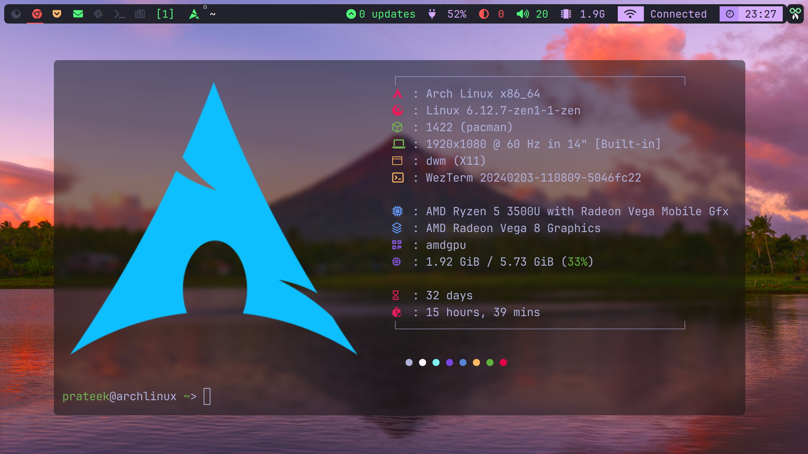

# prateek-chadwm

This repository contains my personal build of ChadWM, a minimalist tiling window manager based on dwm and maintained by Siduck. I've made several modifications and enhancements to suit my workflow and preferences.

## What is ChadWM?

ChadWM is a fork of dwm (dynamic window manager) created by Siduck. It aims to provide a fast, lightweight, and highly customizable window management experience. It's known for its simplicity, efficiency and beauty.


## My Modifications

This build incorporates the following changes and additions:

*   **Expanded Colorschemes:** Added a selection of additional color schemes to personalize the look and feel.
*   **Increased Workspaces:** Increased the number of available workspaces for better organization.
*   **Workspace Movement:** Implemented functionality to move the current workspace to the left or right virtual desktop using keyboard shortcuts.
*   **Force Kill Functionality:** Added a keybind to force-kill unresponsive applications.
*   **Bash for Bar Execution:** Changed the shell used to execute commands in the bar to Bash for improved compatibility and scripting capabilities.

## Keybindings

Here's a list of some of the most commonly used keybindings in this build:

*   `Super + Return`: Launch WezTerm (terminal emulator)
*   `Super + b`: Launch Zen Browser (web browser)
*   `Super + e`: Launch Dolphin (file manager)
*   `Super + 1 - 7`: Move to workspace 1 - 7
*   `Super + Ctrl + Left/Right`: Move to the left/right workspace
*   `Super + Shift + b`: Toggle the visibility of the status bar
*   `Super + d`: Launch Discord
*   `Super + p`: Launch Mercury Browser (secondary web browser)
*   `Super + v`: Launch CopyQ (clipboard manager)
*   `Super + Shift + q`: Force kill the focused window (kills all instances of the application)
*   `Super + Ctrl + Shift + Left/Right`: Move the current window to left/right workspace
*   `Super + Shift + p`: Launches a private window in Librewolf
*   `Alt + Ctrl + n`: Launches Neovim in WezTerm
*   `Alt + Ctrl + v`: Launches Vim in WezTerm
*   `Alt + Ctrl + r`: Launches ranger in WezTerm
*   `Alt + Ctrl + h`: Launches htop in WezTerm
*   `Super + Left/Right`: Shift between different Layouts
*   `Super + S`: Screenshot menu

## Installation

Since this is a personal build, the installation process might require some manual steps. It's recommended to have a basic understanding of compiling software from source and managing dependencies.

1.  **Clone the repository:**

    ```bash
    git clone https://github.com/prateekshukla1108/prateek-chadwm.git
    cd prateek-chadwm
    ```

2. **Installed the Dependencies**
#### Fedora
1. **Update your system**:
   ```bash
   sudo dnf update
   ```

2. **Install Development Tools and Libraries**:
   ```bash
   sudo dnf install @development-tools git libX11-devel libXft-devel libXinerama-devel ncurses-devel dbus-x11-devel imlib2-devel libconfig-devel
   ```

#### Debian (and Ubuntu)
1. **Update your package index**:
   ```bash
   sudo apt update
   ```

2. **Install Build Essentials and Required Libraries**:
   ```bash
   sudo apt install build-essential git libx11-dev libxft-dev libxinerama-dev libncurses5-dev libdbus-1-dev libimlib2-dev libconfig-dev
   ```

#### Arch Linux
1. **Update your system**:
   ```bash
   sudo pacman -Syu
   ```

2. **Install Base Development Packages and Required Libraries**:
   ```bash
   sudo pacman -S base-devel git libx11 libxft libxinerama ncurses dbus imlib2 libconfig
   ```

#### Void Linux
1. **Update your package repository**:
   ```bash
   sudo xbps-install -S
   ```

2. **Install Development Tools and Libraries**:
   ```bash
   sudo xbps-install -y base-devel git libX11-devel libXft-devel libXinerama-devel ncurses-devel dbus-x11-devel imlib2-devel libconfig-devel
   ```

3.  **Compile:**

    ```bash
    make
    ```

4.  **Install (as root):**

    ```bash
    sudo make install
    ```

5.  **Configure your `.xinitrc`:** Add the following line to your `.xinitrc` file (usually located in your home directory):

    ```bash
    exec chadwm
    ```

6.  **Start X:** Start your X server (e.g., using `startx`).

## Customization

You can further customize this build by modifying the `config.h` file. After making changes, you'll need to recompile and reinstall.

## Credits

This is made on top of siduck's chadwm configuration. Go follow him he is excellent developer and its all possible because of him.

*   [Siduck](https://github.com/siduck) for creating and maintaining ChadWM.
*   The dwm community for the original window manager.

## License

This project is licensed under the MIT License - see the [LICENSE](LICENSE) file for details.# Screenshots

